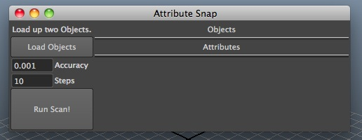

# Attrsnap

_Attribute Snap_

A Maya tool that assists in "sticking" objects to positions or rotations using non-standard attributes.
The tool calculates its position by brute force, so it is highly universal.

# Installation:

Simply copy the folder into your scripts directory in Maya. The folder should be named "attrsnap". Rename it to that if it is not.

# Usage

Within Maya, create a shelf icon with the following PYTHON code:

	import attrsnap
	attrsnap.main()

<!--  -->

* Begin by deciding on two markers (objects) you wish to keep as close as possible to each other. Often it is easiest to constrain some locators to the spots you wish to connect and choose them. For example, you could constrain a locator to a knee bone, and have another sitting on the surface of an object, if you wish to have the knee stick to the surface.

* Select both markers (locators perhaps) and "New markers from selection" button.

* Select the attributes of objects you wish to use (in the channelbox) and click the "New attribute from channelbox" button. Remember that this snapping is computationally intensive. The more attributes you use or the further apart the objects are, the longer it will take. Often it's best to animate the objects very close by hand, and then stick them with only a couple attributes.

* Highlight a range in the time-slider if you wish to snap on multiple frames, or else move to the single frame you wish snap on.

* Click "Do it!" to begin snapping the objects.

* Do the same for any other groups you might wish to snap at the same time.

* If you have multiple groups, and want to exclude them from the process without deleting them, untick the "enable" checkbox.
